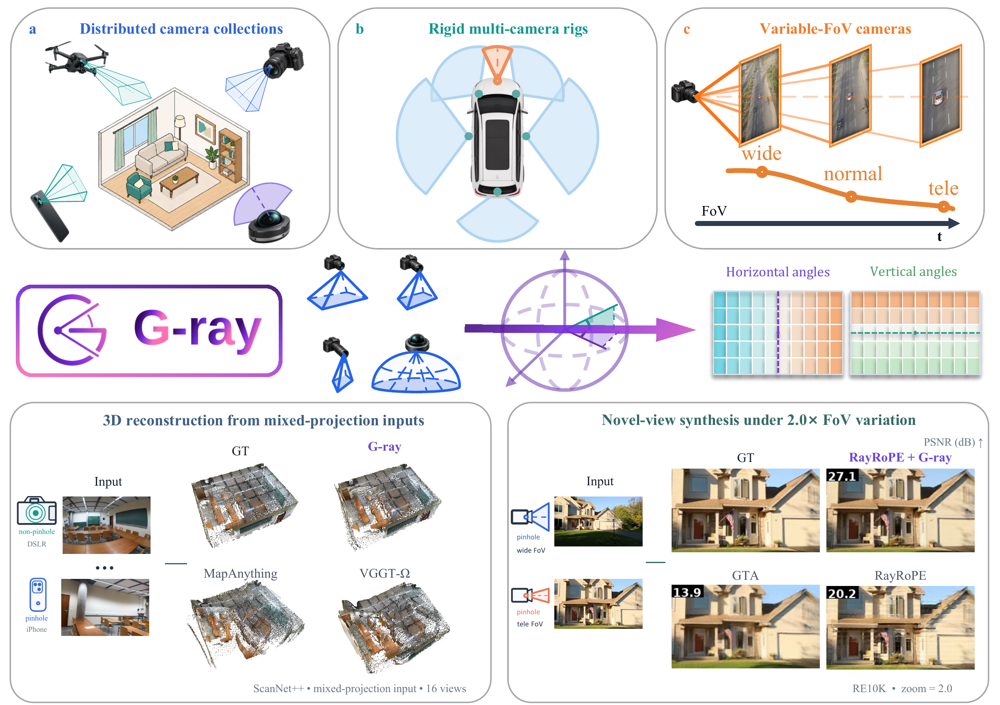

# G-ray

## Ray-Level Relative Geometric Position Encoding in Multi-View Visual Transformers under Camera Heterogeneity

Official repository for **G-ray**, a ray-level relative position encoding for multi-view visual Transformers under camera heterogeneity.

[Project Page](https://g-ray-project.github.io/)

**Paper:** Link coming soon.

## Code Release

**Code will be coming soon.**
